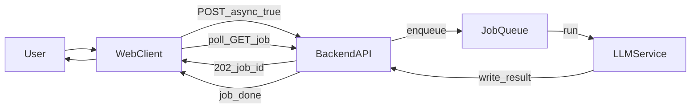

# 《文献插入功能》开发规格文档

## 文档信息

| 项 | 内容 |
|----|------|
| 文档名称 | 文献插入功能 — 开发规格 |
| 当前版本 | v1.0 |
| 状态 | 草案（实现基线） |
| 适用范围 | AI 文献助手 Web 产品 — MVP 单功能 |

### 修订记录

| 版本 | 日期 | 作者 | 变更摘要 |
|------|------|------|----------|
| v1.0 | 2026-04-20 | 项目组 | 首版：范围、流程、接口、数据模型、验收与里程碑 |

---

## 1. 背景与目标

### 1.1 背景

本产品为 **AI 文献助手**，以 **Web 网站** 为首要形态。用户在日常写作中需要为论断补充文献支撑；本功能在用户 **导入或粘贴正文** 后，由系统自动在合适位置插入引用标记，并生成 **参考文献列表**，降低手工检索与排版成本。

### 1.2 本阶段目标（唯一功能范围）

在不做账号体系、个人文献库、PDF 全文解析、浏览器/Office 插件的前提下，完成 **「用户导入文本 → 文献插入 → 带引用正文 + 参考文献表」** 的端到端能力规格，供前后端与模型侧对齐实现与验收。

### 1.3 成功标准（验收口径）

- 用户可通过粘贴或上传文件导入正文，并获得 **带引用标记的正文** 与 **参考文献表**。
- 正文中的引用编号（或作者-年份形式）与参考文献表 **一一对应或可映射**，无悬空引用、无重复编号冲突（同一文献多次出现应复用同一引用键）。
- 引用与相邻论断在语义上 **大致相关**；系统对 **未接权威检索** 场景下的不确定性有 **明确产品提示**（见第 6、16 节）。

---

## 2. 术语表

| 术语 | 定义 |
|------|------|
| 文献插入 | 在正文中插入引用标记，并生成可列出的参考文献条目 |
| 主张句 / 论断 | 需要外部证据支撑的陈述（如因果、比较、量化结论、强泛化等） |
| 引用样式 | 正文中引用标记的展示规则，如数字方括号、作者-年份等 |
| 参考文献表 | 按样式规则列出的文献元数据列表，与正文引用对应 |
| 分块（Chunk） | 将长文本按段落或固定窗口切分为模型可处理的单元 |
| 异步任务（Job） | 长文本处理时后端接受请求后返回任务 ID，客户端轮询或通过 SSE 获取结果 |

---

## 3. 范围说明

### 3.1 MVP 包含

- 文本输入：**大段粘贴**；文件 **`.txt` 必选**，**`.md` 可选**。
- 用户可选参数：**语言**（中/英）、**引用样式**、**引用密度**（少/中/多）、**同步/异步**（由长度或用户显式指定触发）。
- 处理逻辑：对正文分段、识别需支撑论断、生成候选文献、对齐与去重、插入引用标记、生成参考文献表。
- 输出：**复制**、**下载**（`.txt` 或 `.md`，与产品约定一致即可）。
- 基础错误处理：空文本、超长、编码异常、上游超时、模型失败重试或降级说明。

### 3.2 MVP 明确不包含

- 用户注册登录、团队权限、付费。
- 个人文献库、题录导入（BibTeX/EndNote）、PDF 全文解析与定位。
- 浏览器插件、Word/LaTeX 插件。
- **强制**与 Crossref / Semantic Scholar 等外部库的逐条在线核验（可作为 **二期**「检索增强」模块，本规格仅 **预留接口与开关**，默认 **关闭**）。

---

## 4. 用户故事与业务流程

### 4.1 用户故事

- **US-1**：作为写作者，我粘贴一章中文初稿，选择「中文 + 数字方括号引用 + 中等密度」，希望得到插入引用后的正文与参考文献表，便于继续修改。
- **US-2**：作为写作者，我上传 `.txt` 文件，系统应正确识别 UTF-8；若编码无法解析，应给出可读错误提示。
- **US-3**：作为写作者，当文本较长时，我提交后能看到 **处理进度**（或阶段提示），并在合理时间内得到结果或失败原因。

### 4.2 主流程

1. 用户进入「文献插入」页面。
2. 输入文本（粘贴或上传），配置语言、引用样式、引用密度、是否异步（或由系统根据长度建议）。
3. 提交 → 后端校验 → 调用 **LLM 服务**（结构化输出）→ 合并分块结果（若存在）→ 返回或写入 Job 结果。
4. 前端展示 **双栏预览**（左侧可保留原始结构或分段结构，右侧为带引用结果）及参考文献表；支持复制与下载。
5. 页面固定展示 **免责声明**（见第 16 节）。

### 4.3 异常与边界流程

| 场景 | 预期行为 |
|------|----------|
| 空文本或仅空白 | 返回 400，提示「请输入正文」 |
| 超过服务端配置的最大字符数 | 返回 413，提示上限与建议（分段粘贴或异步） |
| 非 UTF-8 或非法字节序列 | 返回 400，提示重新导出为 UTF-8 |
| 含大量公式（如 `$...$`）或代码块 | 策略：**默认不**在公式/代码行内插入引用；仅对自然语言段落处理（产品说明中写明） |
| 模型超时或上游 5xx | 返回 502 或 500（见错误码表）；可配置有限次重试；失败时提示稍后重试 |
| 用户取消异步任务 | 若实现取消：Job 状态为 `cancelled`，不再写入结果 |

---

## 5. 功能需求（FR）

| ID | 需求描述 | 优先级 |
|----|----------|--------|
| FR-1 | 提供多行文本输入区，支持至少 **50,000 字符**（实际上限以部署配置为准，文档建议默认 50k） | P0 |
| FR-2 | 支持上传 `.txt`；可选支持 `.md` | P0 |
| FR-3 | 服务端对输入做预处理：统一换行、去除零宽字符；可选「按空行分段」保留结构 | P1 |
| FR-4 | 请求参数：`language`、`style`、`density`、`async`（见接口节） | P0 |
| FR-5 | 返回 `text_with_citations` 与 `references` 数组；可选 `warnings` | P0 |
| FR-6 | 短文本走 **同步** 响应；长文本走 **异步 Job**，支持进度查询 | P0 |
| FR-7 | 前端提供复制正文、复制参考文献、整页下载 | P1 |
| FR-8 | 展示处理耗时、请求 ID（便于排错）；不展示敏感密钥 | P1 |
| FR-9 | 二期预留：`retrieval.enabled` 与检索提供商标识；MVP 默认关闭 | P2 |

---

## 6. 非功能需求（NFR）

| ID | 类别 | 描述 |
|----|------|------|
| NFR-1 | 性能 | 短文本（建议 &lt; 3,000 字）目标 **P95 延迟** 在可接受范围（具体数值由压测后写入部署文档）；长文本必须异步 |
| NFR-2 | 可用性 | 错误信息 **中文**、可行动（告知如何修正） |
| NFR-3 | 安全与隐私 | **默认不持久化**用户全文；若业务必须记录，需单独隐私条款、加密存储与留存周期，本 MVP 推荐 **不落库全文** |
| NFR-4 | 限流 | 对 `POST /citations/insert` 实施 IP/用户级限流，返回 429 |
| NFR-5 | 合规与产品诚实性 | 对「模型可能生成无法查证的文献」做 **固定文案提示**（见第 16 节） |

---

## 7. 业务规则

### 7.1 引用样式（`style` 枚举建议）

| 取值 | 正文示例 | 说明 |
|------|----------|------|
| `numeric_brackets` | 深度学习在 NLP 中广泛应用`[1]`。 | 数字方括号，国标类场景常用 |
| `numeric_superscript` | 同上（上标渲染由前端完成时可与 `numeric_brackets` 共用编号逻辑） | 可选 |
| `author_year` | 深度学习在 NLP 中广泛应用（Zhang et al., 2023）。 | 作者-年份 |

具体标点（中英文括号、et al. 规则）在附录给出示例；实现以本文档与 golden 用例为准迭代。

### 7.2 引用密度（`density`）

| 取值 | 行为描述 |
|------|----------|
| `low` | 仅对高置信「需支撑」论断插入引用，整体引用条数少 |
| `medium` | 默认平衡 |
| `high` | 更多单元附带引用（仍应避免无意义堆砌） |

### 7.3 分块与插入位置

- **分块**：优先 **按段落**；超长段落按 **句子窗口** 切分，窗口带 **overlap**（建议可配置，如 `chunk_size` 字符、`overlap` 比例），避免论断被切断。
- **插入位置**：**默认**在「该分块所对应论断句」**句末**插入；若多分块共享同一文献，**复用同一引用 id**。
- **去重**：标题+第一作者姓氏+年份 相似度高于阈值则合并为一条参考文献。

### 7.4 语言（`language`）

| 取值 | 说明 |
|------|------|
| `zh` | 中文正文为主，参考文献题名等可中英混合 |
| `en` | 英文正文为主 |

---

## 8. 系统架构

### 8.1 逻辑组件

- **Web 前端**：表单、参数、结果双栏、复制/下载、异步进度、免责声明常驻。
- **后端 API**：鉴权（若未来有）、校验、限流、编排分块、调用 LLM、合并结果、Job 存储（内存或 Redis，实现待定）。
- **LLM 服务**：接收分块或全文（在上下文允许内），输出 **结构化 JSON**（建议 JSON Schema 约束）。
- **检索增强模块（二期）**：Crossref / Semantic Scholar 等；通过配置开关接入；MVP **关闭**。

### 8.2 数据流示意（Mermaid）

**同步路径：**


**异步路径：**



---

## 9. 接口规格

### 9.1 `POST /api/v1/citations/insert`

**说明**：创建文献插入任务；`async: false` 时直接返回结果；`async: true` 时返回 `job_id`，客户端轮询 `GET /api/v1/jobs/{job_id}`（或采用 SSE，二选一实现，规格以 Job 为最小契约）。

#### 请求头

| 头 | 必填 | 说明 |
|----|------|------|
| `Content-Type` | 是 | `application/json` |
| `Accept-Language` | 否 | 影响错误信息语言，默认 `zh-CN` |

#### 请求体（JSON）

| 字段 | 类型 | 必填 | 说明 |
|------|------|------|------|
| `text` | string | 是 | 用户正文 |
| `language` | string | 否 | `zh` \| `en`，默认 `zh` |
| `style` | string | 否 | 见 7.1，默认 `numeric_brackets` |
| `density` | string | 否 | `low` \| `medium` \| `high`，默认 `medium` |
| `async` | boolean | 否 | `true` 时异步；默认 `false`。服务端可对超长文本 **强制** `async`（响应 202） |
| `retrieval` | object | 否 | MVP 可忽略；二期 `{ "enabled": boolean }` |

#### 同步成功响应 `200 OK`

| 字段 | 类型 | 说明 |
|------|------|------|
| `text_with_citations` | string | 插入引用后的全文 |
| `references` | array | 见第 10 节 `Reference` |
| `warnings` | array of string | 如模型低置信、未启用检索等 |
| `meta` | object | 可选：`model`、`duration_ms`、`request_id` |

#### 异步接受响应 `202 Accepted`

| 字段 | 类型 | 说明 |
|------|------|------|
| `job_id` | string | 任务标识 |
| `status` | string | 建议固定 `queued` |
| `poll_url` | string | 可选，便于客户端直接轮询 |

### 9.2 `GET /api/v1/jobs/{job_id}`

#### 响应 `200 OK`（Body 示例字段）

| 字段 | 类型 | 说明 |
|------|------|------|
| `job_id` | string | 与创建时一致 |
| `status` | string | `queued` \| `running` \| `succeeded` \| `failed` \| `cancelled` |
| `progress` | number | 可选，0–100 |
| `result` | object | 仅 `succeeded` 时存在，结构与同步 200 一致 |
| `error` | object | 仅 `failed` 时存在，含 `code`、`message` |

### 9.3 错误码与 HTTP 状态

| HTTP | `error.code`（建议） | 场景 |
|------|----------------------|------|
| 400 | `INVALID_INPUT` | 空文本、非法 `style`/`density`/`language` |
| 400 | `INVALID_ENCODING` | 上传内容非合法 UTF-8 |
| 413 | `PAYLOAD_TOO_LARGE` | 超过最大字符数 |
| 429 | `RATE_LIMITED` | 触发限流 |
| 500 | `MODEL_ERROR` | 模型返回不可解析或业务判定失败 |
| 502 | `UPSTREAM_TIMEOUT` | LLM 或网关超时 |

**响应体（错误时）建议形状：**

```json
{
  "error": {
    "code": "INVALID_INPUT",
    "message": "请输入正文",
    "request_id": "req_xxx"
  }
}
```

---

## 10. 数据模型

### 10.1 `Reference`（参考文献条目）

| 字段 | 类型 | 必填 | 说明 |
|------|------|------|------|
| `id` | integer | 是 | 正文中引用对应编号，从 1 递增 |
| `authors` | array of string | 是 | 作者列表；显示用 |
| `title` | string | 是 | 文献题名 |
| `year` | integer \| null | 否 | 发表年份 |
| `venue` | string \| null | 否 | 期刊/会议/出版社/网站名 |
| `doi` | string \| null | 否 | DOI；无检索时可为 null |
| `url` | string \| null | 否 | 可访问链接 |

### 10.2 内部结构（实现与测试可对齐，可不暴露给 API）

| 结构 | 用途 |
|------|------|
| `Span` | `span_id`、`raw_text`、`offset_start`、`offset_end` |
| `Claim` | `claim_id`、`span_id`、`claim_text`、`evidence_type` |
| `CandidateRef` | 模型输出的候选文献，合并前可含 `confidence`（0–1） |

---

## 11. 算法与工程策略

### 11.1 推荐流水线（三阶段）

1. **阶段 A — 主张提取**：输入分块文本，输出 `(span_id, claim_text, evidence_type)` 列表。
2. **阶段 B — 候选文献**：对每个 claim 输出若干 `CandidateRef`（含 `confidence`）。
3. **阶段 C — 全局合并**：跨分块去重、重排 `id`、在原文对应位置插入引用标记，生成 `text_with_citations` 与最终 `references`。

### 11.2 结构化输出与降级

- 强制 **JSON** 输出；使用 **JSON Schema** 校验；解析失败时 **有限重试**（如 1–2 次）。
- **降级策略**：若仍失败，可返回 `warnings` 并仅输出「参考文献表草稿」或提示用户缩短文本，具体文案由产品确认。

### 11.3 配置参数（建议后端可配置）

| 参数 | 说明 |
|------|------|
| `max_chars` | 单次请求最大字符数 |
| `sync_max_chars` | 超过则强制异步或拒绝 |
| `chunk_size` / `chunk_overlap` | 分块大小与重叠 |
| `llm_timeout_ms` | 上游超时 |

---

## 12. 前端交互说明

| 区域 | 要求 |
|------|------|
| 输入区 | 大文本域 + 上传按钮；显示当前字数 |
| 参数区 | 语言、样式、密度、异步选项（或「长文本自动异步」说明） |
| 结果区 | 双栏：左原文/结构预览，右 `text_with_citations`；下方独立 `references` 列表 |
| 操作 | 一键复制、下载；异步时进度条或阶段文案 |
| 合规 | 页脚或结果区顶部 **固定展示** 免责声明（第 16 节） |

---

## 13. 测试与验收

### 13.1 自动断言（最低集）

- 正文出现的最大引用编号 **等于** `references.length`（在 `numeric_*` 样式下）。
- 无「空引用」：`[ ]`、无对应 `Reference` 的编号等。
- 同一 `id` 在 `references` 中唯一。

### 13.2 样例集（建议规模）

- **中文** 10 段、**英文** 10 段，覆盖：综述口吻、方法描述、含数据句子、纯背景叙述（应少量或无需引用）。
- **边界**：空输入、近上限长度、含 Markdown 代码块、含行内公式。

### 13.3 人工抽检

- 抽样比例与量表由团队自定；建议对「引用与相邻句相关性」打 1–5 分，记录于测试周报。

---

## 14. 里程碑

| 阶段 | 交付物 |
|------|--------|
| M0 | 静态页面 + 假数据打通 UI 与下载/复制 |
| M1 | 同步 `POST /api/v1/citations/insert` + 真实 LLM + JSON 解析与渲染 |
| M2 | 分块合并、样式与密度参数、错误码与降级 |
| M3 | 异步 Job、轮询或 SSE、限流与基础监控 |

---

## 15. 附录 A：引用样式示例片段

**数字方括号：**

> Transformer 架构已成为现代 NLP 的基础`[1]`。后续工作不断改进位置编码`[2]`。

**作者-年份：**

> Transformer 架构已成为现代 NLP 的基础（Vaswani et al., 2017）。

---

## 16. 附录 B：免责声明模板（建议原文展示）

> 本功能由人工智能生成引用与参考文献，**可能存在不准确或无法查证的条目**。正式发表、投稿或法律依据类用途，请务必通过权威数据库或原始出版物进行人工核对。请勿向本服务提交保密或敏感内容。

---

**文档结束**
